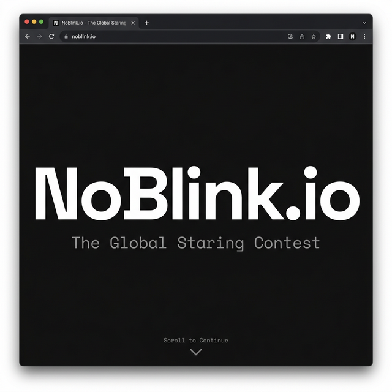
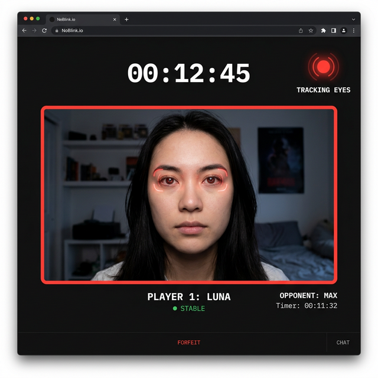
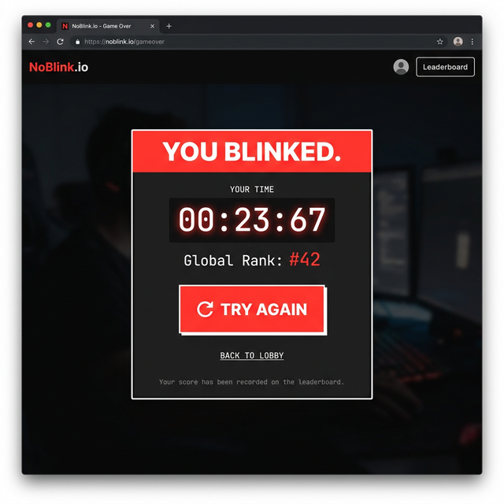

# NoBlink.io

**The Global Staring Contest** -- a real-time browser game where players compete to hold their eyes open the longest. Computer vision tracks your blinks using your webcam, and the moment you blink, the game ends.

Play against yourself, climb the global leaderboard, and see how long you can last.

---

## How It Works

1. Grant camera access to enable eye tracking
2. Stare at the screen without blinking
3. MediaPipe Face Mesh runs in your browser, tracking 468 facial landmarks at ~30 FPS
4. The backend calculates your Eye Aspect Ratio (EAR) in real-time over WebSocket
5. The moment you blink, the game ends and your time is recorded

---

## Screenshots

### Landing Page

The entry point with a full-screen hero, health disclaimer, and acknowledgement checkbox.



### Game Lobby

Camera preview, system status, global leaderboard, and how-to-play instructions.

### Gameplay

Live webcam feed with real-time eye tracking, timer, and status indicator.



### Game Over

Results modal showing your time, global rank, and leaderboard placement.



---

## Tech Stack

| Layer | Technology |
|---|---|
| Frontend | React + TypeScript (Vite) |
| Styling | Tailwind CSS |
| Face Detection | MediaPipe Face Mesh (browser-side) |
| Backend | FastAPI + Uvicorn (async Python) |
| Blink Detection | Custom EAR algorithm on MediaPipe landmarks |
| Real-time | WebSockets |
| Database | MongoDB (motor async driver) |
| Leaderboard | Redis Sorted Sets |

---

## Architecture

```
                Browser                                    Server
  +-------------------------------+       +-------------------------------------+
  |                               |       |                                     |
  |  MediaPipe Face Mesh          |       |  FastAPI                            |
  |  (468 facial landmarks)       |       |                                     |
  |         |                     |       |  +-------------+  +-------------+   |
  |         v                     |       |  |  ML Engine  |  | Anti-Cheat  |   |
  |  Extract 12 eye landmarks     | WS    |  |  (EAR calc) |  | (validation)|   |
  |  (6 per eye)                  |------>|  +-------------+  +-------------+   |
  |                               | 30fps |         |                           |
  |  React UI                     |       |  +------v------+  +----------+      |
  |  (timer, status, game over)   |<------|  | Blink       |  | Redis    |      |
  |                               | events|  | Detector    |  | (leader  |      |
  +-------------------------------+       |  | (adaptive   |  |  board)  |      |
                                          |  |  calibration|  +----------+      |
                                          |  |  + smoothing)|                    |
                                          |  +-------------+  +----------+      |
                                          |                    | MongoDB  |      |
                                          |                    | (users,  |      |
                                          |                    |  sessions|      |
                                          |                    +----------+      |
                                          +-------------------------------------+
```

---

## Quick Start

### Prerequisites

- **Node.js 18+** and **npm**
- **Python 3.11+**
- **Redis** -- `brew install redis && redis-server` (or [Upstash](https://upstash.com) free tier)
- **MongoDB** -- `brew install mongodb-community` (or [MongoDB Atlas](https://www.mongodb.com/atlas) free tier)

### Backend

```bash
cd backend

# Create virtual environment
python -m venv venv
source venv/bin/activate

# Install dependencies
pip install -r requirements.txt

# Configure environment
cp .env.example .env
# Edit .env with your MongoDB and Redis connection strings

# Start the server
uvicorn app.main:app --reload --port 8000
```

The API will be available at `http://localhost:8000` with Swagger docs at `/docs`.

### Frontend

```bash
cd frontend

# Install dependencies
npm install

# Start development server
npm run dev
```

The app will be available at `http://localhost:5173`.

### Running Tests

```bash
cd backend
source venv/bin/activate
python -m pytest tests/ -v
```

---

## Blink Detection

The blink detection pipeline uses the **Eye Aspect Ratio (EAR)** formula from Soukupova and Cech (2016):

```
EAR = (||p2-p6|| + ||p3-p5||) / (2 * ||p1-p4||)
```

Where p1-p6 are the six landmarks around each eye. Key features:

- **Adaptive calibration**: The first 30 frames establish a per-player EAR baseline
- **Dynamic threshold**: Set to 62% of the 25th-percentile baseline EAR
- **EAR smoothing**: Rolling average of the last 5 frames filters tracking noise
- **Consecutive frame requirement**: 5+ consecutive low-EAR frames needed to confirm a blink (~170ms at 30 FPS)
- **Anti-cheat validation**: Server-side checks for frozen landmarks, impossible EAR values, and frame rate anomalies

---

## Project Structure

```
NoBlink.io/
|-- frontend/                  # React + TypeScript (Vite)
|   |-- src/
|   |   |-- app/
|   |   |   |-- screens/       # Landing, PreGame, Gameplay, GameOver
|   |   |   |-- components/    # Leaderboard, AuthModal
|   |   |   |-- api.ts         # API client + WebSocket helpers
|   |   |   +-- routes.ts      # React Router config
|   |   +-- styles/
|   |-- package.json
|   +-- vite.config.ts
|
|-- backend/                   # FastAPI + Python
|   |-- app/
|   |   |-- main.py            # FastAPI app + routes
|   |   |-- ml_engine.py       # EAR calculation + BlinkDetector
|   |   |-- anti_cheat.py      # Frame validation + cheat detection
|   |   |-- websocket_manager.py  # WS session state machine
|   |   |-- leaderboard.py     # Redis sorted set operations
|   |   |-- database.py        # Async MongoDB client
|   |   |-- models.py          # MongoDB document schemas
|   |   +-- schemas.py         # Pydantic request/response models
|   |-- tests/
|   |-- requirements.txt
|   +-- README.md              # Detailed backend documentation
|
|-- docs/screenshots/          # Application screenshots
|-- CODE_OF_CONDUCT.md
|-- CONTRIBUTING.md
+-- LICENSE                    # MIT
```

---

## API Overview

| Method | Path | Description |
|---|---|---|
| `GET` | `/api/health` | Health check (DB + Redis status) |
| `POST` | `/api/users` | Register / get-or-create user |
| `GET` | `/api/users/{user_id}/stats` | User profile + session history |
| `GET` | `/api/leaderboard` | Top 100 longest stares today |
| `GET` | `/api/leaderboard/{user_id}/rank` | User's rank on today's board |
| `WS` | `/ws/staring-contest/{client_id}` | Real-time game session |

See the [backend README](backend/README.md) for full API documentation including WebSocket message formats.

---

## Contributing

See [CONTRIBUTING.md](CONTRIBUTING.md) for guidelines on how to contribute.

## License

This project is licensed under the [MIT License](LICENSE).
